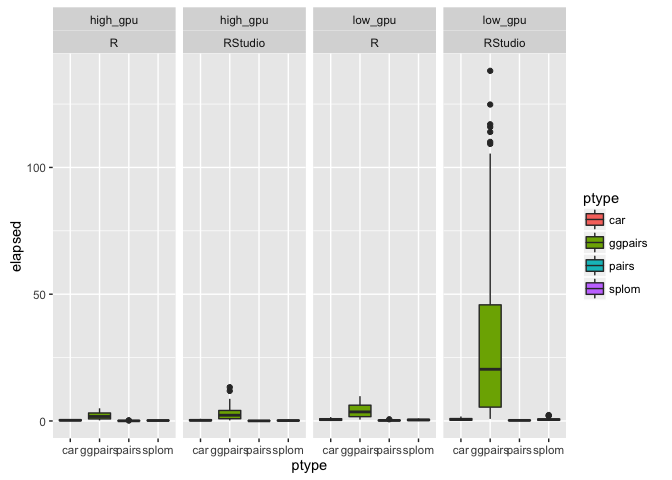
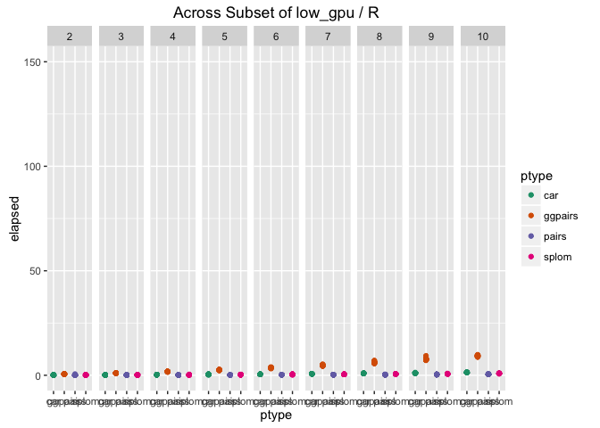
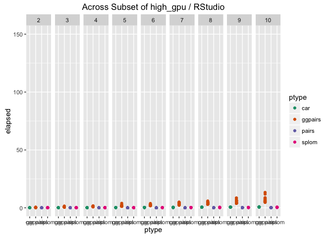
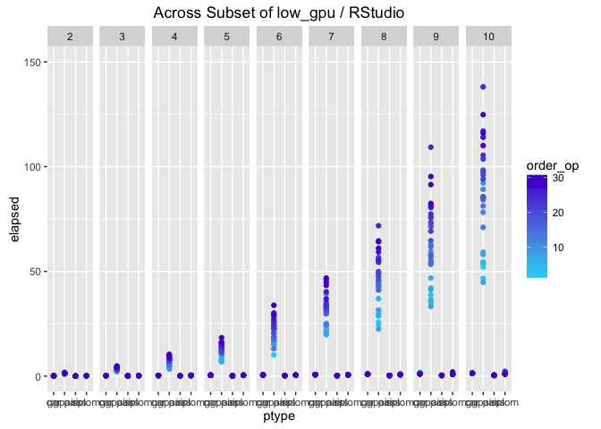

Evaluating Computing Time for Pairwise Visualizations
================

Summary of Findings
-------------------

All pairwise graphing functions, but most significantly ggpairs, are affected by the following regressors:

-   number of variables
-   number of successive tasks
-   computing environment
-   IDE

Background
----------

The purpose of this exercise was to better understand the issues affecting computing time, hereafter elapsed time, for four popular pairwise visualization functions: pairs, ggpairs, splom (in the lattice library), and scatterplotMatrix (in the car library). I will abbreviate scatterplotMatrix as "car" for purposes of space.

My interest in this subject is personal. After a frustrating night of coding, in which ggpairs seemed to freeze and then crash the R Studio environment multiple times, I went to the internet where I found others having similar issues, but no clear solution. In the short term, I found that ggpairs was not freezing at all, but executing extremely slowly, and it was my own bumbling input during the slow execution that caused R Studio to crash. But the question remained: why should ggpairs execute so much slower than other pairwise functions I had used?

Generating Test Data
--------------------

To generate test data for this exercise, I created a data frame of 10 vectors, each with 100 normal random numbers (mean=0, sd=1).

``` r
for (i in 1:10) {
  temp <- paste("x", i, sep="")
  set.seed(i)
  assign(temp, rnorm(100))
}

df = data.frame(x1, x2, x3, x4, x5, x6, x7, x8, x9, x10)
```

To test this data, I reviewed a number of potential interactions with elapsed time:

-   function type (of the 4 identified)
-   number of variables in pairwise function (2:10)
-   computing environment / power
-   IDE (RStudio or R)

I ran a loop which executed each of the four pairwise functions using an increasingly large subset of variables in the test data frame (min=2, max=10). To gather a sufficiently large sample, I ran this loop 30 times for each function.

``` r
#example code for pairs()
samplesize = 30
elapsed_pairs = matrix(, nrow = samplesize * (ncol(df)-1), ncol = 3, byrow=TRUE)  #pre-build matrix for memory purposes
i = 2
j = 1
while (j < samplesize+1) {
  while (i < ncol(df)+1) 
  {
    r <- (i-1) + (ncol(df)-1)*(j-1)
    start_time <- Sys.time()
    print(pairs(df[1:i]))
    end_time <- Sys.time()
    dev.off()
    elapsed_pairs[r, 1] <- "pairs"
    elapsed_pairs[r, 2] <- i      #number of variables
    elapsed_pairs[r, 3] <- difftime(end_time, start_time, units = c("secs"))
    i = i+1
  }
  i = 2
  j = j+1
}
```

First, I should note that I intentionally separated each function, rather than run all simultaneously. I had already experienced lag issues with ggpairs on my machine, and initial testing indicated that I would need to separate functions for stability.

Also note that I called the pairwise functions using print() in order to force R to create each graph. Otherwise, there would be little variation in the data. I also cleared the graphics using dev.off() after every iteration to ensure full execution.

Finally, I used the function difftime in order to stipulate the unit of measure (seconds).

IDEs and Computing Environment
------------------------------

From my own research into this issue, it was clear to me that not all users were experiencing issues with ggpairs. I decided to test my IDE, and so ran all code on both RStudio and R, tagging my outcomes as such.

I also performed a very basic test of computing environment. Not having many resources at my disposal, I tested all code (including both IDEs) on two machines. I have listed below the differences in GPU, which I believe is likely the main driver of any significant effects. For brevity, I labeled these machines "win" and "mac", but their differences are obviously more extreme than just operating system. Further work would need to be done to truly quantify the effect of the computing environment.

<table style="width:96%;">
<colgroup>
<col width="36%" />
<col width="27%" />
<col width="31%" />
</colgroup>
<thead>
<tr class="header">
<th align="left">Field</th>
<th align="left">&quot;win&quot;</th>
<th align="left">&quot;mac&quot;</th>
</tr>
</thead>
<tbody>
<tr class="odd">
<td align="left">OS</td>
<td align="left">Windows 10</td>
<td align="left">OS X 10.11.6</td>
</tr>
<tr class="even">
<td align="left">GPU Name</td>
<td align="left">AMD Radeon R5 340X</td>
<td align="left">Intel HD Graphics 5000</td>
</tr>
<tr class="odd">
<td align="left">Cores</td>
<td align="left">384</td>
<td align="left">40</td>
</tr>
<tr class="even">
<td align="left">TMUs</td>
<td align="left">24</td>
<td align="left">8</td>
</tr>
<tr class="odd">
<td align="left">ROPs</td>
<td align="left">8</td>
<td align="left">2</td>
</tr>
<tr class="even">
<td align="left">Base Clock Speed</td>
<td align="left">1000 MHz</td>
<td align="left">200 MHz</td>
</tr>
<tr class="odd">
<td align="left">Memory Clock (Effective)</td>
<td align="left">1000 (2000) MHz</td>
<td align="left">system shared</td>
</tr>
<tr class="even">
<td align="left">Computing Power</td>
<td align="left">806 GFLOPS</td>
<td align="left">640</td>
</tr>
<tr class="odd">
<td align="left">Memory Size</td>
<td align="left">2048 MB DDR3</td>
<td align="left">system shared</td>
</tr>
<tr class="even">
<td align="left">Memory Bus Width</td>
<td align="left">128-bit</td>
<td align="left">system shared</td>
</tr>
<tr class="odd">
<td align="left">Memory Bandwidth</td>
<td align="left">32 GB/s</td>
<td align="left">system shared</td>
</tr>
</tbody>
</table>

Finally, I bound my code into a single data frame.

``` r
elapsed_data <- read.csv("elapsed.csv", header=TRUE)
head(elapsed_data)
```

    ##   order ptype vars    elapsed env ide
    ## 1     1 pairs    2 0.07813406 win   R
    ## 2     2 pairs    3 0.07902503 win   R
    ## 3     3 pairs    4 0.09377098 win   R
    ## 4     4 pairs    5 0.07813311 win   R
    ## 5     5 pairs    6 0.10937905 win   R
    ## 6     6 pairs    7 0.11398101 win   R

``` r
str(elapsed_data)
```

    ## 'data.frame':    4320 obs. of  6 variables:
    ##  $ order  : int  1 2 3 4 5 6 7 8 9 10 ...
    ##  $ ptype  : Factor w/ 4 levels "car","ggpairs",..: 3 3 3 3 3 3 3 3 3 3 ...
    ##  $ vars   : int  2 3 4 5 6 7 8 9 10 2 ...
    ##  $ elapsed: num  0.0781 0.079 0.0938 0.0781 0.1094 ...
    ##  $ env    : Factor w/ 2 levels "mac","win": 2 2 2 2 2 2 2 2 2 2 ...
    ##  $ ide    : Factor w/ 2 levels "R","RStudio": 1 1 1 1 1 1 1 1 1 1 ...

Analysis
--------

Once we visualize the distribution of data, several issues become clear. Here we see a boxplot for each function type, broken down by computing environment and then IDE. There is an obvious spike in elapsed time with ggpairs on "mac" using RStudio.

``` r
library(ggplot2)
ggplot(elapsed_data, aes(x=ptype, y=elapsed, fill=ptype)) + geom_boxplot() + facet_wrap(~ env + ide, ncol=9)
```



But is that the end of the story? What about the number of variables used in a pairwise function? Let's take a look at some scatterplots using subsets of the data to focus more closely on the number of variables.

``` r
#scatterplot by ptype, across subsets
ggplot(subset(elapsed_data, env=="mac" & ide=="RStudio"), aes(x=ptype, y=elapsed, color=ptype)) + geom_point() + scale_color_brewer(type='qual', palette=2) + ylim(0,150) + facet_wrap(~ vars, ncol=9) + labs(title="Across Subset of Mac / RStudio")
```


``` r
ggplot(subset(elapsed_data, env=="mac" & ide=="R"), aes(x=ptype, y=elapsed, color=ptype)) + geom_point() + scale_color_brewer(type='qual', palette=2) + ylim(0,150) + facet_wrap(~ vars, ncol=9) + labs(title="Across Subset of Mac / R")
```



``` r
ggplot(subset(elapsed_data, env=="win" & ide=="RStudio"), aes(x=ptype, y=elapsed, color=ptype)) + geom_point() + scale_color_brewer(type='qual', palette=2) + ylim(0,150) + facet_wrap(~ vars, ncol=9) + labs(title="Across Subset of Win / RStudio")
```



``` r
ggplot(subset(elapsed_data, env=="win" & ide=="R"), aes(x=ptype, y=elapsed, color=ptype)) + geom_point() + scale_color_brewer(type='qual', palette=2) + ylim(0,150) + facet_wrap(~ vars, ncol=9) + labs(title="Across Subset of Win / R")
```


For comparison purposes, I kept the dimensions of each graph identical. In these visualizations we can begin to see that there is an exponential growth in time elapsed based on the number of variables in the pairwise function. Obviously, the effect is most pronounced for ggpairs.

Now let's take a look at an analysis of variance. As you can see, each one of our suspected interactions is highly significant.

``` r
#Analysis of Variance
aov_test <- aov(elapsed ~ ptype + env + ide, data=elapsed_data)
summary(aov_test)
```

    ##               Df Sum Sq Mean Sq F value Pr(>F)    
    ## ptype          3  72409   24136   281.9 <2e-16 ***
    ## env            1  16244   16244   189.7 <2e-16 ***
    ## ide            1  12158   12158   142.0 <2e-16 ***
    ## Residuals   4314 369421      86                   
    ## ---
    ## Signif. codes:  0 '***' 0.001 '**' 0.01 '*' 0.05 '.' 0.1 ' ' 1

Using a regression model with all interactions, we achieve high significance, but not a very high R-squared value. Note that forward, backward, and stepwise regression all choose this same model.

``` r
#Full Regression Model, then with log(y)
model_full <- lm(elapsed ~ vars + ptype + env + ide, data=elapsed_data)
summary(model_full)
```

    ## 
    ## Call:
    ## lm(formula = elapsed ~ vars + ptype + env + ide, data = elapsed_data)
    ## 
    ## Residuals:
    ##     Min      1Q  Median      3Q     Max 
    ##  -9.190  -4.193  -1.106   1.887 121.333 
    ## 
    ## Coefficients:
    ##              Estimate Std. Error t value Pr(>|t|)    
    ## (Intercept)  -4.34183    0.46199  -9.398   <2e-16 ***
    ## vars          0.84535    0.05299  15.952   <2e-16 ***
    ## ptypeggpairs  9.30567    0.38701  24.045   <2e-16 ***
    ## ptypepairs   -0.31808    0.38701  -0.822    0.411    
    ## ptypesplom   -0.11854    0.38701  -0.306    0.759    
    ## envwin       -3.87829    0.27366 -14.172   <2e-16 ***
    ## ideRStudio    3.35518    0.27366  12.260   <2e-16 ***
    ## ---
    ## Signif. codes:  0 '***' 0.001 '**' 0.01 '*' 0.05 '.' 0.1 ' ' 1
    ## 
    ## Residual standard error: 8.993 on 4313 degrees of freedom
    ## Multiple R-squared:  0.2582, Adjusted R-squared:  0.2571 
    ## F-statistic: 250.1 on 6 and 4313 DF,  p-value: < 2.2e-16

We next attempt a log transformation of time elapsed, using the same independent variables. Et voila, high significance and high predictive power.

``` r
model_full_log <- lm(log(elapsed) ~ vars + ptype + env + ide, data=elapsed_data)
summary(model_full_log)
```

    ## 
    ## Call:
    ## lm(formula = log(elapsed) ~ vars + ptype + env + ide, data = elapsed_data)
    ## 
    ## Residuals:
    ##      Min       1Q   Median       3Q      Max 
    ## -1.10742 -0.26036 -0.02819  0.18950  2.51983 
    ## 
    ## Coefficients:
    ##               Estimate Std. Error t value Pr(>|t|)    
    ## (Intercept)  -2.452897   0.021463 -114.29   <2e-16 ***
    ## vars          0.296191   0.002462  120.31   <2e-16 ***
    ## ptypeggpairs  2.322584   0.017979  129.18   <2e-16 ***
    ## ptypepairs   -1.157166   0.017979  -64.36   <2e-16 ***
    ## ptypesplom   -0.225838   0.017979  -12.56   <2e-16 ***
    ## envwin       -1.114881   0.012713  -87.69   <2e-16 ***
    ## ideRStudio    0.232865   0.012713   18.32   <2e-16 ***
    ## ---
    ## Signif. codes:  0 '***' 0.001 '**' 0.01 '*' 0.05 '.' 0.1 ' ' 1
    ## 
    ## Residual standard error: 0.4178 on 4313 degrees of freedom
    ## Multiple R-squared:  0.936,  Adjusted R-squared:  0.9359 
    ## F-statistic: 1.052e+04 on 6 and 4313 DF,  p-value: < 2.2e-16

However, I'm not entirely happy with this data. If we look back at some of our scatterplots, there is a high variance in some of the data, especially for ggpairs as the number of variables increased. What is causing this variation? While doing data cleaning, I noticed that as the loops in the code wore on, time elapsed seemed to be increasing. I needed a way to test this, so I performed some basic math on what was a previously unused "counter" variable. Now our data set includes a vector for order\_op, which carries the sequential order of operations for each time a pairwise function is run against a particular set of variables.

``` r
#Fixing up the order
elapsed_data$order_op <- ((((elapsed_data$order %% 270) - 1) %/% 9) + 1)

for (x in 1:nrow(elapsed_data)) {
  if (elapsed_data$order_op[x] == 0) {
    elapsed_data$order_op[x] = 30
  }
}
```

A visualization should help elucidate.

``` r
ggplot(subset(elapsed_data, env=="mac" & ide=="RStudio"), aes(x=ptype, y=elapsed, color=order_op)) + geom_point() + scale_color_gradient(low='#05D9F6', high='#5011D1') + ylim(0,150) + facet_wrap(~ vars, ncol=9) + labs(title="Across Subset of Mac / RStudio")
```



As you can see, as the code approaches it's 30th loop, elapsed time increases. The effect is more pronounced for a higher number of variables, corresponding to the previously seen exponential growth. This effect is most noticeable for ggpairs on "mac" using RStudio.

But is it significant?

``` r
aov_test_op <- aov(elapsed ~ ptype + env + ide + order_op, data=elapsed_data)
summary(aov_test_op)
```

    ##               Df Sum Sq Mean Sq F value   Pr(>F)    
    ## ptype          3  72409   24136  282.58  < 2e-16 ***
    ## env            1  16244   16244  190.19  < 2e-16 ***
    ## ide            1  12158   12158  142.34  < 2e-16 ***
    ## order_op       1   1033    1033   12.09 0.000511 ***
    ## Residuals   4313 368388      85                     
    ## ---
    ## Signif. codes:  0 '***' 0.001 '**' 0.01 '*' 0.05 '.' 0.1 ' ' 1

Yes.

Finally, we add order\_op to our previous regression model.

``` r
model_full_log_op <- lm(log(elapsed) ~ vars + ptype + env + ide + order_op, data=elapsed_data)
summary(model_full_log_op)
```

    ## 
    ## Call:
    ## lm(formula = log(elapsed) ~ vars + ptype + env + ide + order_op, 
    ##     data = elapsed_data)
    ## 
    ## Residuals:
    ##      Min       1Q   Median       3Q      Max 
    ## -1.09931 -0.25945 -0.02824  0.19750  2.55232 
    ## 
    ## Coefficients:
    ##                Estimate Std. Error  t value Pr(>|t|)    
    ## (Intercept)  -2.4876336  0.0242711 -102.494  < 2e-16 ***
    ## vars          0.2961910  0.0024595  120.425  < 2e-16 ***
    ## ptypeggpairs  2.3225840  0.0179620  129.305  < 2e-16 ***
    ## ptypepairs   -1.1571658  0.0179620  -64.423  < 2e-16 ***
    ## ptypesplom   -0.2258382  0.0179620  -12.573  < 2e-16 ***
    ## envwin       -1.1148805  0.0127011  -87.779  < 2e-16 ***
    ## ideRStudio    0.2328654  0.0127011   18.334  < 2e-16 ***
    ## order_op      0.0022411  0.0007337    3.054  0.00227 ** 
    ## ---
    ## Signif. codes:  0 '***' 0.001 '**' 0.01 '*' 0.05 '.' 0.1 ' ' 1
    ## 
    ## Residual standard error: 0.4174 on 4312 degrees of freedom
    ## Multiple R-squared:  0.9362, Adjusted R-squared:  0.9361 
    ## F-statistic:  9034 on 7 and 4312 DF,  p-value: < 2.2e-16

Now, notice that adding order\_op only increases our predictive power (both R-squared and adjusted R-squared) by 0.2%. For a more parsimonious model, we could probably leave this variable out.

However, I do believe this variable suggests an interesting, and possibly overlooked dynamic. Although order\_op is technically measuring the number of iterations in a loop, it is actually providing insight into how many successive tasks the computing environment has performed without a break. On certain machines, especially those designed for low power usage or those without a dedicated cooling mechanism, the number of successive tasks will have an adverse affect on elapsed time.

Summary
-------

In conclusion, there are several variables which affect the speed at which a pairwise function can graph a relationship. All users will need to contend with the number of variables used and the number of successive tasks performed by the computing environment. Users of RStudio will trade performance for its many handy features. However, users with a high-end computing environment will notice these effects much less. It is users with a low-end computing environment that should take this analysis into consideration.
